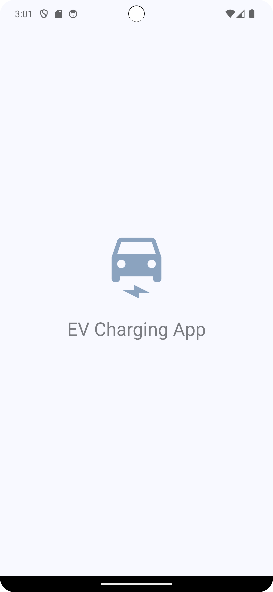
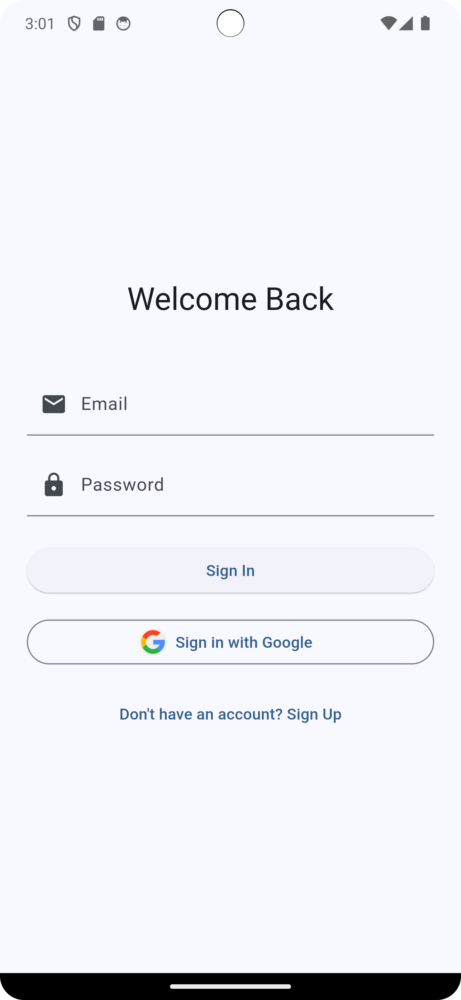
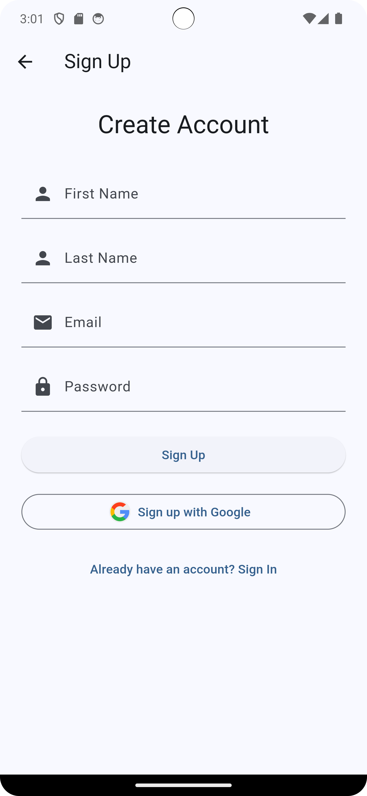
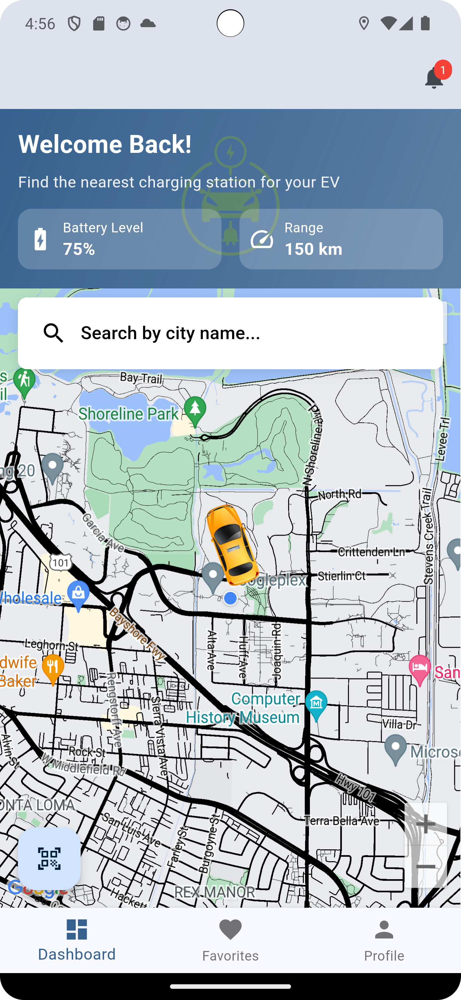
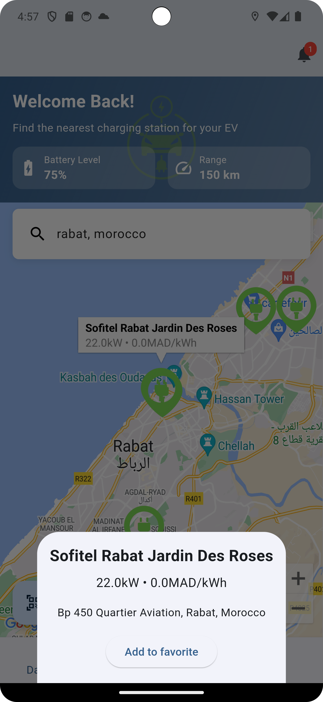
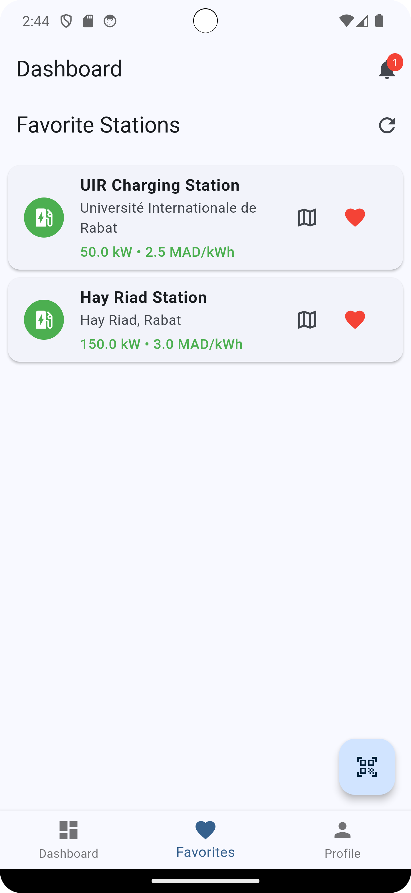
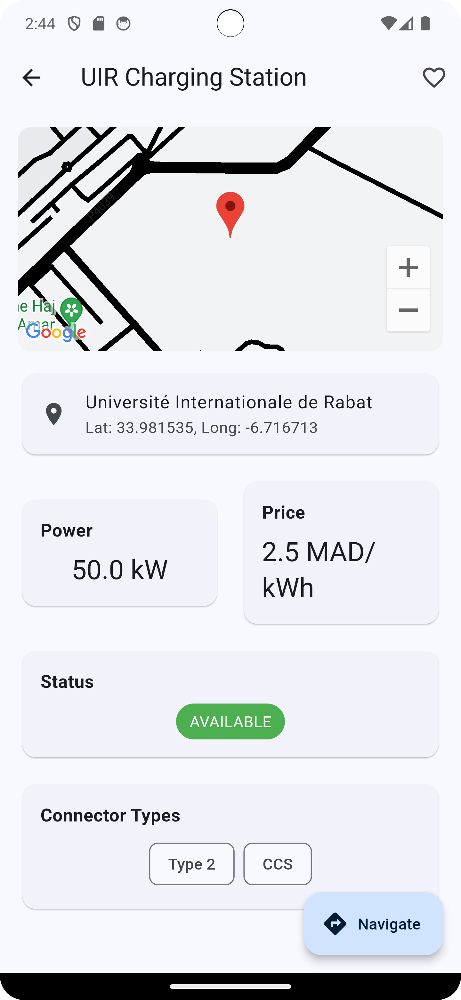
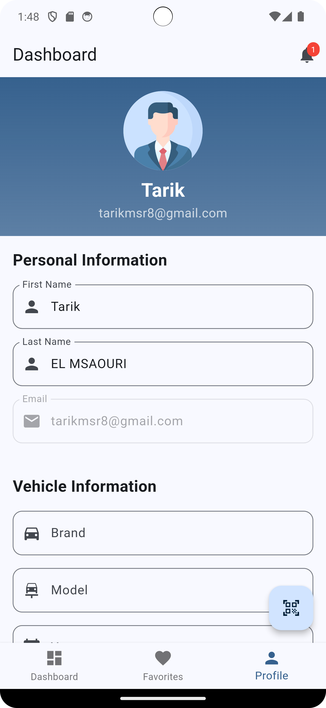
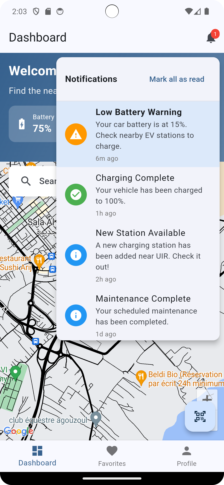

# EV Charging Station Finder 

A modern, user-friendly mobile application that helps electric vehicle owners find and manage charging stations. Built with Flutter and Firebase, this app provides real-time information about charging station availability, city-based station search, and intelligent location services to help you find the nearest charging points.

## Overview

- 🔍 **Smart Search**: Find charging stations in any city with our intelligent search feature
- 📍 **Location Tracking**: See your position and nearby stations in real-time
- ⚡  **Station Details**: Get instant access to power ratings and pricing information
- 🌟 **Favorites**: Save and manage your preferred charging locations
- 🌙 **Dark Mode**: Comfortable viewing in any lighting condition
- 🚗 **Vehicle Management**: Store your EV details for a personalized experience

See the [Screenshots](#-screenshots) section below for a visual tour of the app's features.

##  Key Features

### For Users
- **Advanced Location Services** 
  - Search for charging stations by city name
  - View your current location on the map
  - See nearby charging stations in real-time
  - Get detailed station markers with power and price info

- **Station Management** 
  - Save favorite charging stations
  - Quick access to frequently used stations
  - View detailed station information
  - Rate and review stations

- **Smart Features** 
  - QR code scanning for quick station access
  - Real-time availability updates
  - Price comparison between stations
  - Charging history tracking

- **User Profile** 
  - Personalized user dashboard
  - Vehicle information management
  - Customizable app settings
  - Push notification preferences

### Technical Features
- Material 3 Design with beautiful UI/UX
- Intelligent city-based search with geocoding
- Real-time location tracking and updates
- Firebase Authentication and Cloud Firestore
- Secure data persistence and synchronization
- Customizable user preferences
- Push notification system
- Google Maps integration with custom markers
- Efficient state management with Provider
- Cross-platform compatibility

##  Getting Started

### For Users

1. Create an account using:
   - Email and password
   - Google account
   - Apple ID (iOS only)

2. Allow location permissions for the best experience

### For Developers

#### Prerequisites
- [Flutter](https://flutter.dev/docs/get-started/install) (3.0.0 or higher)
- [Firebase Account](https://firebase.google.com/)
- [Android Studio](https://developer.android.com/studio) or [VS Code](https://code.visualstudio.com/)
- [Git](https://git-scm.com/)

#### Setup Instructions

1. **Clone the Repository**
   ```bash
   git clone https://github.com/tarikmsr/ev_charging_station.git
   cd ev_charging_app
   ```

2. **Install Dependencies**
   ```bash
   flutter pub get
   ```

3. **Firebase Setup**
   - Create a new Firebase project
   - Add Android & iOS apps in Firebase console
   - Download and add configuration files:
     - `google-services.json` for Android
     - `GoogleService-Info.plist` for iOS
   - Enable Authentication and Firestore in Firebase console

4. **Configure Environment**
   - Copy `.env.example` to `.env`
   - Add your API keys and configuration

5. **Run the App**
   ```bash
   flutter run
   ```

##  Project Structure
```
lib/
├── core/                  # Core functionality
│   ├── app_assets/        # Images and icons
│   ├── config/            # firebase config
│   ├── models/            # Data models
│   ├── services/          # Service classes
│   ├── routes/            # App routes
│   └── services/          # Shared services
│   └── utils/             # Shared tools
├── features/              # Feature modules
│   ├── authentication/    # Auth feature
│   ├── charging_stations/ # Stations feature
│   ├── dashboard/         # Dashboard feature
│   └── profile/          # Profile feature
└── main.dart             # App entry point
```

##  Security Features
- Secure user authentication
- Protected API endpoints
- Firestore security rules
- Data encryption
- Safe credential storage

##  Supported Platforms
- Android 5.0 (API 21) or higher
- iOS 12 or higher

##  Built With
- [Flutter](https://flutter.dev/) - UI framework
- [Firebase](https://firebase.google.com/) - Backend services
- [Google Maps](https://developers.google.com/maps) - Maps integration
- [Provider](https://pub.dev/packages/provider) - State management
- [Geolocator](https://pub.dev/packages/geolocator) - Location services

##  Database Structure

### Users Collection
```json
{
  "users": {
    "<userId>": {
      "email": "string",
      "firstName": "string",
      "lastName": "string",
      "phone": "string",
      "car": {
        "brand": "string",
        "model": "string"
      },
      "settings": {
        "pushNotifications": "boolean",
        "locationServices": "boolean",
        "darkMode": "boolean"
      },
      "favoriteStations": ["stationId1", "stationId2"],
      "createdAt": "timestamp",
      "updatedAt": "timestamp"
    }
  }
}
```

### Stations Collection
```json
{
  "stations": {
    "<stationId>": {
      "name": "string",
      "latitude": "number",
      "longitude": "number",
      "address": "string",
      "city": "string",
      "available": "boolean",
      "power": "number",
      "pricePerKwh": "number",
      "connectorTypes": ["Type2", "CCS"],
      "description": "string",
      "openingHours": {
        "weekdays": "string",
        "weekends": "string"
      },
      "reviews": [{
        "userId": "string",
        "rating": "number",
        "comment": "string",
        "createdAt": "timestamp"
      }],
      "stats": {
        "totalCharges": "number",
        "averageRating": "number"
      },
      "createdAt": "timestamp",
      "updatedAt": "timestamp"
    }
  }
}
```

##  Contributing
1. Fork the repository
2. Create your feature branch (`git checkout -b feature/AmazingFeature`)
3. Commit your changes (`git commit -m 'Add some AmazingFeature'`)
4. Push to the branch (`git push origin feature/AmazingFeature`)
5. Open a Pull Request

##  License
This project is licensed under the MIT License - see the [LICENSE](LICENSE) file for details.


##  Acknowledgments
- [Flutter Team](https://flutter.dev/team)
- [Firebase](https://firebase.google.com)
- All our amazing contributors!

## 📱 Screenshots

### Authentication
<div style="display: flex; flex-wrap: wrap; gap: 10px; justify-content: space-between;">
    
    
    
</div>

### Location & Stations
<div style="display: flex; flex-wrap: wrap; gap: 10px; justify-content: space-between; margin-top: 10px;">
    
    
    
</div>

### Station Management
<div style="display: flex; flex-wrap: wrap; gap: 10px; justify-content: space-between; margin-top: 10px;">
    
    
    
</div>

### User Experience
<div style="display: flex; flex-wrap: wrap; gap: 10px; justify-content: space-between; margin-top: 10px;">
    
    
</div>